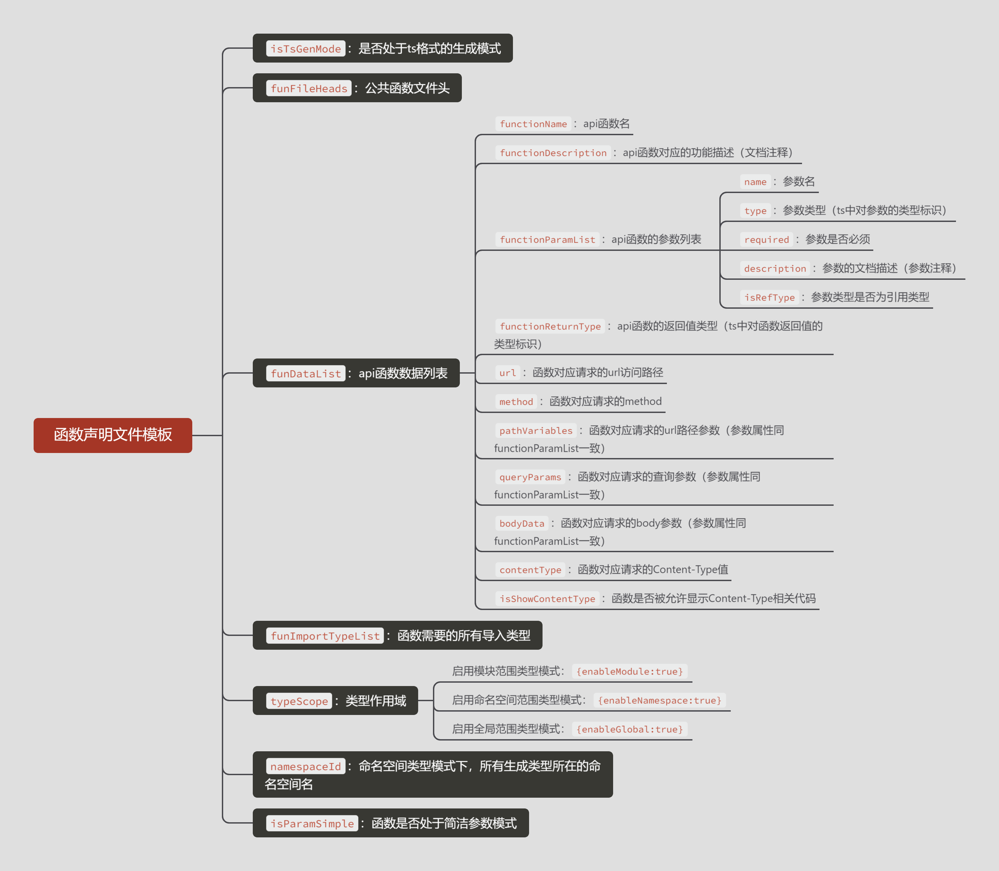

# api-code-creater

## 介绍
解析后端提供的api文档，自动为前端生成相应的请求调用函数代码。

相关
* 文档解析要求：目前仅支持解析`OpenApi3`的JSON文件。
* 核心生成机制：按照同一首路径对api进行分组，一组api所有函数声明生成一个`同组名`的`函数声明文件(.ts)`，并将所有函数声明文件中用到的引用类型合并生成一个`类型声明文件(.d.ts)`。
* 特色优势：
    * 默认以vue常用的axios封装api请求格式为模板，方便vue项目开发。
    * 提供了大量内置可用的模板数据，以便自定义其他样式的模板，提高兼容。
    * 提供对生成的函数名与类型名的修正 与 排序处理。

## 基础用法
步骤1：安装生成器
```
npm i api-code-creater -save-dev
```
步骤2：在项目根目录新建 `api.config.js`, 用以配置生成器的执行函数
```js
const {generateService} = require('api-code-creater')
const path = require("path");

generateService({
    inputFilePath: path.join(__dirname, './openapi.json'),
    outputDirPath: path.join(__dirname, './src/api'),
})
```
步骤3：在 `package.json` 的 `script` 中添加 `生成api的脚本命令`: 
```json
{
  "scripts": {
    "api": "node api.config.js"
  }
}
```
步骤4：生成api
```
npm run api
```


## 配置说明
### 基础必填项：
生成器执行函数必须填写如下两个参数，以确定解析文档路径 与 生成代码存放路径：

| 参数            | 描述                        |
|---------------|---------------------------|
| inputFilePath | 输入文件路径（后端Api文件的json文件的路径） | 
| outputDirPath | 输出目录路径（生成Api代码的存放目录）      | 

```
generateService({
    inputFilePath: path.join(__dirname, './openapi.json'),
    outputDirPath: path.join(__dirname, './src/api'),
})
```
### 可选功能项：
#### 1. 设置生成样式
生成器默认基于内置的axios模板完成函数声明文件与类型声明文件中的内容生成，可以采用：
* 默认模式 - 选择基于axios封装请求的固定内容格式
* 自定义模式 - 自由定义内容格式

>需要注意的是：采用默认axios模板时，项目中axios请求需设置响应成功返回`response.data`，而非`response`!

##### 1）公共函数文件头
默认情况下，每一个函数声明文件的头部都存在语句`import request from '@/utils/request';`
若要自定义所有函数声明文件的公共文件头，可通过`funFileHeads参数`设置：

```js
// 假设1：
// 以如下一条语句提高默认语句：
// import request from './utils/request';
generateService({
  ...,
  funFileHeads: ["import request from './utils/request';"],
})
// 假设2：
// 想每个函数声明文件的头部都依次存在如下一些语句：（默认语句不再存在）
// import aaa from '@/aaa';
// import bbb from '@/bbb';
// import ccc from '@/ccc';
generateService({
  ...,
  funFileHeads: [
    "import aaa from '@/aaa';",
    "import bbb from '@/bbb';",
    "import ccc from '@/ccc';"
  ],
})
```
##### 2）函数参数风格 

通过`funParamMode参数`进行函数参数风格的设置，其存在两种可选模式：
* 'default': 默认参数模式，函数的参数会呈现所有
* 'simple': 简洁参数模式，函数的参数会聚合为 路径参数、查询参数、body参数


| 模式     | 配置                                                  | 效果示例                                                         |
|--------|-----------------------------------------------------|--------------------------------------------------------------|
| 默认参数模式 | `缺省funParamMode参数` 或<br/> `funParamMode: "default"` | 如：`listUsers(keyword:string,pageSize:number,pageNum:number)` |
| 简洁参数模式 | `funParamMode: "simple"`                            | 如：`listUsers(params:UserListParam)`                          |


##### 3）函数类型风格

通过`funTypeMode参数`进行函数类型风格的设置，其存在两种可选模式：
* 'default': 默认类型模式，函数的类型按文档中原类型进行显示
* 'generics': 泛型类型模式，函数的类型会基于通用返回类型呈现泛型，需同步配置commonReturnTypes

| 模式     | 配置                                                                                   | 效果示例                                                    |
|--------|--------------------------------------------------------------------------------------|---------------------------------------------------------|
| 默认类型模式 | `缺省funTypeMode参数` 或<br/> `funTypeMode: "default"`                                    | 如：`getUser(id:number):Promise<CommonResultUser>{...}`   |
| 泛型类型模式 | `funTypeMode: "generics"` 并<br/> `commonReturnTypes: ['CommonResult', 'CommonPage']` | 如：`getUser(id:number):Promise<CommonResult<User>>{...}` |

注：此处泛型配置中的commonReturnTypes需按实际后端提供api文档来填写，这里是假设后端提供api中存在通用返回类型CommonResult与CommonPage，这样包含这两个字符串的所有类型都会自动据此分割成泛型！

##### 4）声明类型的作用域
>声明类型：类型声明文件中声明的类型，函数声明文件中会引用作为某些函数中某个参数类型或返回值类型

通过`typeScope参数`设置声明类型的作用域，其存在三种可选模式：
* 'module': 缺省默认的模块范围类型模式，类型仅限导入其所在声明文件的模块使用
* 'namespace': 命名空间范围类型模式，类型可全局通过指定命令空间调用（默认命名空间名为API，若需改动需自定义namespaceId值）
* 'global': 全局范围类型模式，类型可全局调用，但需注意类型名全局唯一可能发生命名冲突（通常不建议使用！！！）

注：若为 namespace 或 global，其最终生成的类型声明文件需加入TypeScript编译，其他ts文件才能正常解析该文件中声明的全局类型

| 模式         | 配置                                           | 效果示例（示例采用默认类型模式）                                                                          |
|------------|----------------------------------------------|-------------------------------------------------------------------------------------------|
| 模块范围类型模式   | `缺省typeScope参数` 或<br/> `typeScope: "module"` | 如：`getUserInfo():Promise<CommonResultUserInfoResult>{...}`<br/>且该函数声明文件头存在相关类型的import导入语句 |
| 命名空间范围类型模式 | `typeScope: "namespace"`                     | 如：`getUserInfo():Promise<API.CommonResultUserInfoResult>{...}`                            |
| 全局范围类型模式   | `typeScope: "global"`                        | 如：`getUserInfo():Promise<CommonResultUserInfoResult>{...}`                                |


##### 5）自定义模板
通过`templatesFolder参数`设置自定义模板的查找目录，然后在此目录下新建函数声明模板与类型声明模板：
* `api-funs.mustache`：函数声明模板
* `api-types.mustache`：类型声明模板

模板需使用[Mustache语法](https://www.npmjs.com/package/mustache)进行编辑，且存在如下一些内置可用的模板数据：




#### 2. 名称修正处理
可通过`funNameFixRules参数`与`typeNameFixRules参数`分别修正 函数文件中的函数名 与 类型文件中的类型名，其值如下修正规则对象数组。

修正规则对象：

| 规则参数         | 描述                | 类型                                                        | 注意                                                                                                                                                            |
|--------------|-------------------|-----------------------------------------------------------|---------------------------------------------------------------------------------------------------------------------------------------------------------------|
| target       | 针对函数名或类型名的匹配目标字符串 | string \| RegExp                                          | `funNameFixRules参数`时以函数名为查找目标，`typeNameFixRules参数`时以类型名为查找目标<li>若为string字符串时，执行完全匹配，指所有完全与该值相同的函数名或类型名所在的字符串对象<li>若为RegExp对象时，执行正则匹配，仅指符合该值匹配规则的函数名或类型名中的匹配部分 |
| replaceValue | 针对匹配目标字符串的替换值     | (groupName?:string)=>string \| (typeName?:string)=>string | `funNameFixRules参数`时,提供默认groupName参数代表目标函数所在的组名（注：同一url首路径划分为一组）<br/>`typeNameFixRules参数`时, 提供默认typeName参数代表目标类型所在的字符串名                                       |


```js
// 假设：
// 想所有api的url对应函数名，都如下/user/xxx的一样进行修正：
// /user/{id} => 默认请求函数名为：{id} => 想修改函数名为：getUser
// /user/info => 默认请求函数名为：info => 想修改函数名为：getUserInfo
// /user/create => 默认请求函数名为：create => 想修改函数名为：addUser
// /user/list => 默认请求函数名为：list => 想修改函数名为：listUsers
// /user/listAll => 默认请求函数名为：listAll => 想修改函数名为：listAllUsers
// /user/update => 默认请求函数名为：update => 想修改函数名为：updateUser
// /user/delete => 默认请求函数名为：delete => 想修改函数名为：deleteUser
// /user/deleteList => 默认请求函数名为：deleteList => 想修改函数名为：deleteUserList
generateService({
  ...,
  funNameFixRules: [
    {target: "{id}", replaceValue: (groupName) => "get"+ toCapitalize(groupName)},
    {target: "info", replaceValue: () => "getUserInfo"},
    {target: "create", replaceValue: (groupName) => "add" + toCapitalize(groupName)},
    {target: "list", replaceValue: (groupName) => "list" + toCapitalize(groupName) + 's'},
    {target: "listAll", replaceValue: (groupName) => "listAll" + toCapitalize(groupName) + 's'},
    {target: "update", replaceValue: (groupName) => "update" + toCapitalize(groupName)},
    {target: "delete", replaceValue: (groupName) => "delete" + toCapitalize(groupName)},
    {target: "deleteList", replaceValue: (groupName) => "delete" + toCapitalize(groupName) + "List"},
  ],
})

// 假设：
// 有些声明类型存在_request后缀 => 想修改类型名Xxx_request为Xxx
// 有些声明类型存在_response后缀 => 想修改类型名Xxx_response为Xxx
// 泛型类型模式下，有些声明类型错误显示有<>字符串 => 想修改类型名Xxx<>为Xxx（可能报错，泛型无变量）
// 泛型类型模式下，有些泛型类型无变量使用报错，需设置默认变量 => 想修改类型名Xxx<>为Xxx（正确）
// 泛型类型模式下，有些泛型类型错误显示有<>字符串 => 想修改类型名Xxx<ListYyy>为Xxx<Yyy>
generateService({
  ...,
  typeNameFixRules: [
    {target: /_request/, replaceValue: () =>  ''},
    {target: /_response/, replaceValue: () =>  ''},
    {target: /<>/, replaceValue: () =>  ''},
    {target: /<Type>/, replaceValue: () =>  '<Type={}>'},
    {target: /<List/, replaceValue: () =>  '<'},
  ],
})
```
注：生成器内置了一个NameConversionTool名称转换工具类，其中存在`toCapitalize函数`可转换字符串为`首字母大写剩下小写`的格式

#### 3. 数据排序处理
可通过`funSortRules`与`typeSortRules`分别为 函数文件中的函数数据 与 类型文件中的类型数据 进行排序处理

```js
// 假设：
// 想按如右顺序排列类型数据: addXxx > getXxx > listXxx > listAllXxx > updateXxx > deleteXxx > deleteXxxList > allocXxx
generateService({
  ...,
  funSortRules: [/^add/, /^get(?!UserInfo)/, /^list/, /^listAll/, /^update/, /^delete/, /^delete[a-zA-Z]+List$/, /^alloc/],
})
// 假设：
// 想按如右顺序排列类型数据: CommonXxx > XxxParam > XxxResult
generateService({
    ...,
    typeSortRules: [/^Common/, /Param$/, /Result$/],
})
```


## 示例
api.config.js配置：

```js
const {generateService, NameConversionTool} = require('api-code-creater');
const path = require("path");
const {toCapitalize} = NameConversionTool;

generateService({
    inputFilePath: path.join(__dirname, './openapi.json'),
    outputDirPath: path.join(__dirname, './src/api'),
    // templatesFolder: ".\\dist\\templates",

    // funFileHeads: ["import request from '@/utils/request';"],
    funParamMode: "simple",
    funTypeMode: "generics",
    commonReturnTypes: ['CommonResult', 'CommonPage'],
    typeScope: "module",
    // typeScope: "namespace",
    // namespaceId: "API",
    // typeScope: "global",

    funNameFixRules: [
        {target: "{id}", replaceValue: (groupName) => "get"+ toCapitalize(groupName)},
        {target: "info", replaceValue: () => "getUserInfo"},
        {target: "create", replaceValue: (groupName) => "add" + toCapitalize(groupName)},
        {target: "list", replaceValue: (groupName) => "list" + toCapitalize(groupName) + 's'},
        {target: "listAll", replaceValue: (groupName) => "listAll" + toCapitalize(groupName) + 's'},
        {target: "update", replaceValue: (groupName) => "update" + toCapitalize(groupName)},
        {target: "delete", replaceValue: (groupName) => "delete" + toCapitalize(groupName)},
        {target: "deleteList", replaceValue: (groupName) => "delete" + toCapitalize(groupName) + "List"},
    ],
    typeNameFixRules: [
        {target: /_request/, replaceValue: () =>  ''},
        {target: /_response/, replaceValue: () =>  ''},
        {target: /<>/, replaceValue: () =>  ''},
        {target: /<Type>/, replaceValue: () =>  '<Type={}>'},
        {target: /<List/, replaceValue: () =>  '<'},
    ],

    funSortRules: [/^add/, /^get(?!UserInfo)/, /^list/, /^listAll/, /^update/, /delete/, /^delete[a-zA-Z]+List$/, /^alloc/],
    typeSortRules: [/^Common/, /Param$/, /Result$/],
})
```
生成：


